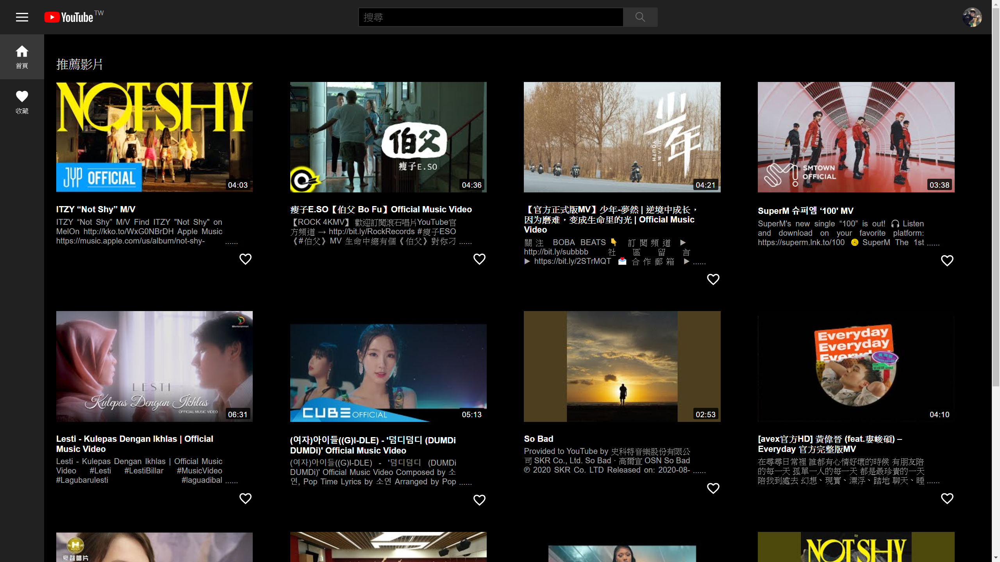
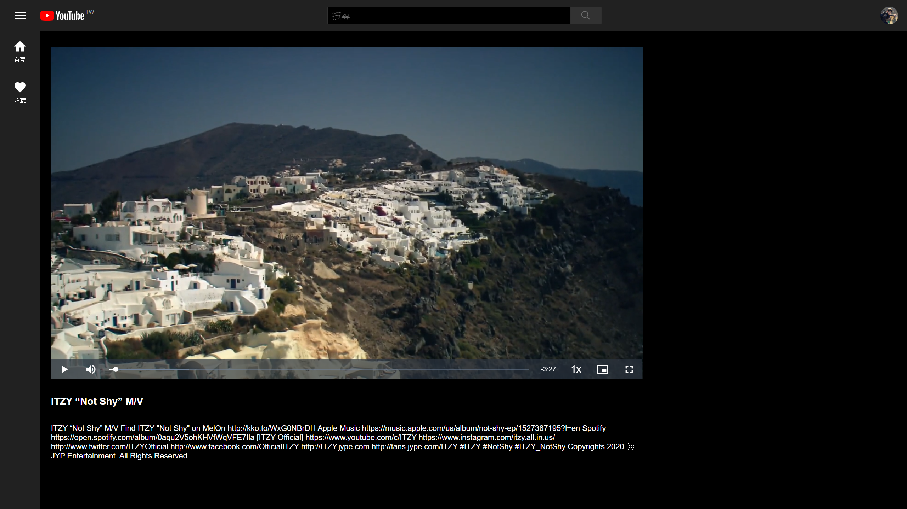

# My YouTube

Simple HTML/CSS/Vue.js/YouTube Data API v3/video.js practice.

[Go to web](https://my-youtube.vercel.app/)

## Overview

### Home



### Video



## Environment variable

[YouTube Data API Overview](https://developers.google.com/youtube/v3/getting-started)

Create `.env` file with the following contents:
```
VUE_APP_YOUTUBE_API_KEY=<Your-YouTube-API-KEY>
```


## Project setup
```
npm install
```

### Compiles and hot-reloads for development
```
npm run serve
```

### Compiles and minifies for production
```
npm run build
```

### Lints and fixes files
```
npm run lint
```
